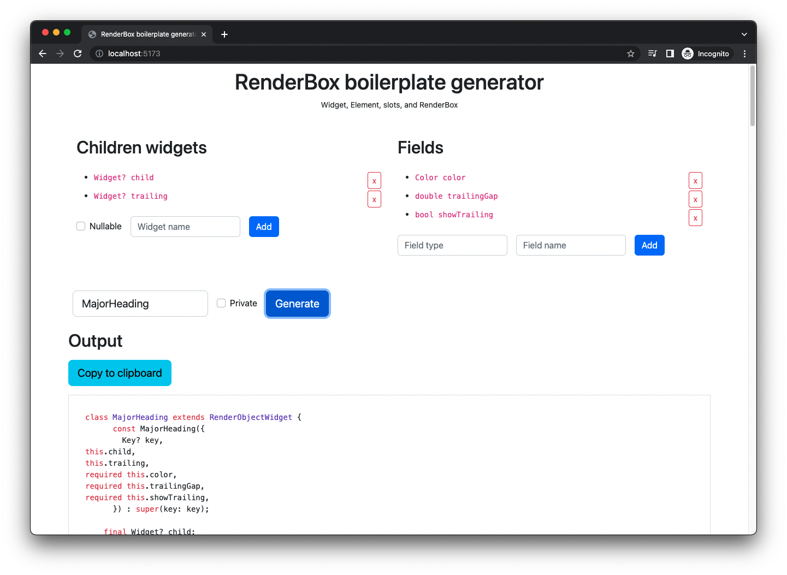

<h1 align="center">Flutter <code>RenderBox</code> boilerplate generator</h1>

[Go to the generator][generator]

[][generator]

## Problem

Sometimes I need to create a custom `RenderBox` in Flutter with a few properties and other widgets inside. Writing code for this every time takes some time and consists of big amount of repeatable boilerplate. I quickly created this small web tool to create such boilerplate for me.

Instead of spending 30 minutes on writing it myself while refreshing the knowledge on particular methods I can easily just put children widgets and fields I want this render box to have and copy the code focusing on implementing the layout, print and other related methods.

### Warning

You may not need to create a very custom `RenderBox` yourself. Firstly, make sure to become acquainted with [Flutter's `RenderBox` documentation](https://api.flutter.dev/flutter/rendering/RenderBox-class.html) as it explains various concepts and protocols related to them as well as its subclasses and helpers that you may want to use instead.

## Disclaimers

* This tool was made to quickly save some time, its source code isn't pretty (I'm not a JS dev) but works.
* Make sure you can't use Flutter-provided shortcuts mentioned in above documentation.
* This tool doesn't generate intrinsics protocol boilerplate.
* This tool generates unformatted code. You should simply paste it in your editor/IDE and format it.

## Running locally

```sh
npm install
npm run dev
```

## Author

[@Albert221](https://github.com/Albert221)

[generator]: https://leancodepl.github.io/render-box-boilerplate-generator/